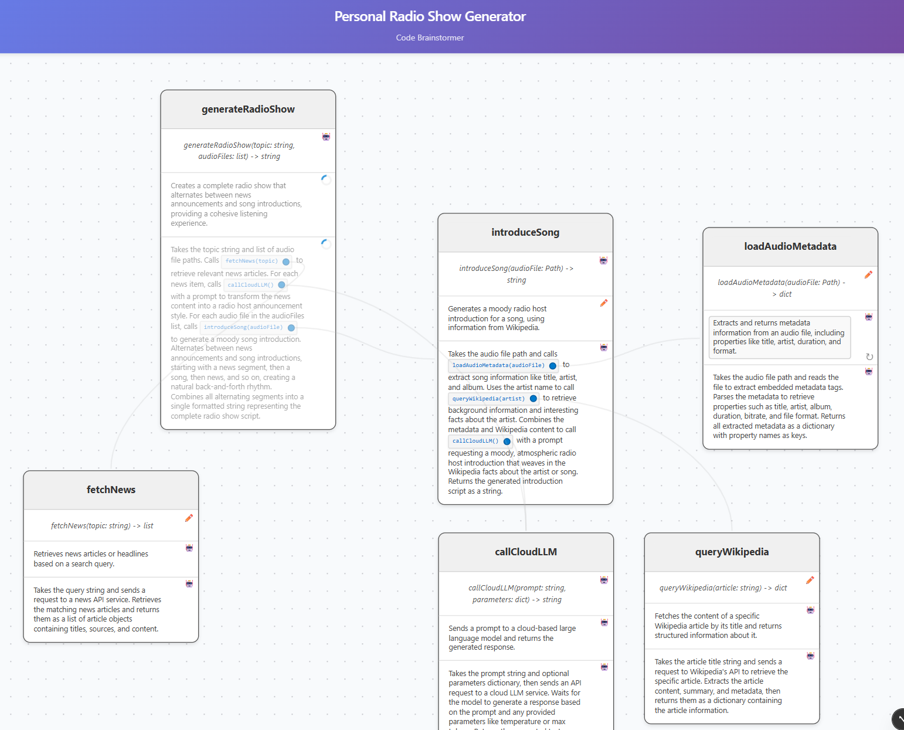

# Code-Brainstormer LM

**Interactive playground for designing, visualizing and iterating on structured programming code in collaboration with an LLM.**



   

## 🚀 Quick Start

Create `.env.local` with your `ANTHROPIC_API_KEY`.

```bash
# Install dependencies
npm install

# Start development server
npm run dev

# Open http://localhost:3000
```

## ✨ Key Features

### 🎯 **Intelligent Double-Click Interactions**
- **Canvas Double-Click**: Create empty functions with auto-focus for immediate typing
- **Orange Function References**: Create named functions from unresolved calls
- **Blue Function References**: Navigate smoothly to existing function definitions

### 🎨 **Smart Visual Design**
- **Grid-Aligned Layouts**: 20px grid with intelligent node placement
- **Smooth Animations**: 800ms viewport transitions with zoom preservation
- **Visual Function Indicators**: Color-coded function calls with hover effects

### 🧠 **LLM-Powered Code Generation**
- **Progressive Aspect Generation**: Edit one aspect, LLM updates the next
- **Context-Aware Suggestions**: Maintains consistency across function definitions
- **Lockable Aspects**: Prevent unwanted changes to stable code

## 🎮 How to Use

### Creating Functions

1. **🆕 New Empty Function**
   - Double-click empty canvas space
   - Node appears at click position with auto-focused identifier
   - Start typing function name immediately

2. **🔗 From Function Call**
   - Double-click orange function reference (e.g., `processData()`)
   - Creates named function near the source
   - Ready for specification and implementation

3. **🧭 Navigate to Existing**
   - Double-click blue function reference
   - Smooth animation to existing function
   - Explore code relationships visually

### Editing Functions

- **Click any field** to edit (identifier, signature, specification)
- **Auto-resize fields** expand to fit your content
- **LLM assistance** generates related aspects automatically
- **Lock/unlock aspects** using the state icons

### Visual Organization

- **Drag nodes** to reorganize - edges update automatically
- **Grid alignment** keeps layouts professional
- **Smart placement** finds optimal positions for new nodes
- **Zoom and pan** freely - all interactions preserve your view

## 📚 Documentation

- **[📖 Project Overview](docs/project_overview.md)** - Architecture and feature overview
- **[🎯 User Interactions Guide](docs/user_interactions.md)** - Comprehensive interaction documentation
- **[🏗️ Architecture & Data Model](docs/architecture_data_model.md)** - Technical implementation details
- **[🤖 Code Generation](docs/codegen.md)** - LLM integration and workflows

## 🛠️ Tech Stack

- **[TypeScript 5.8](https://www.typescriptlang.org/)** - Type-safe development
- **[Next.js 15](https://nextjs.org/)** - React framework with App Router
- **[React Flow 11](https://reactflow.dev/)** - Interactive node-based UI
- **[Zustand 5](https://github.com/pmndrs/zustand)** - Lightweight state management
- **[React Query](https://tanstack.com/query)** - Server state management

## 🏗️ Project Structure

```
├── app/                    # Next.js App Router (pages, layouts, server actions)
├── components/             # React components (ProjectCanvas, FunctionNode)
├── features/               # Feature modules (codegen with LLM backends)
├── store/                  # Zustand state management (codebase store)
├── data/                   # Data schemas and loaders
├── constants/              # Shared constants (node types, colors, etc.)
├── utils/                  # Utility functions (node placement algorithms)
├── lib/                    # Third-party library configurations
├── docs/                   # Architecture and user documentation
└── public/                 # Static assets and example datasets
```

## 🎯 Use Cases

- **🏗️ Architecture Brainstorming** - Sketch service layers and discuss with teams
- **👨‍🏫 Teaching Aid** - Demonstrate clean code decomposition visually
- **🚀 Spike Prototyping** - Validate algorithm breakdowns before coding
- **📝 Doc-as-Code** - Keep design docs in sync with implementation

## 📄 License

This project is licensed under the MIT License - see the [LICENSE](LICENSE) file for details.
